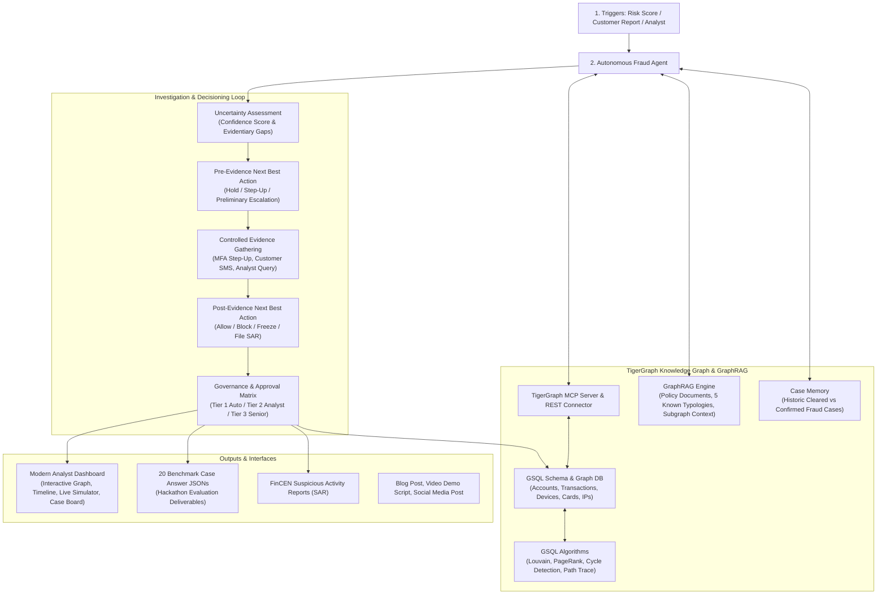

# TigerGraph Agentic Fraud Investigation Agent (HHGOA)

> **Autonomous AI Agent for Fraud Investigation, GraphRAG Grounding, and Next-Best Action**  
> Built for the TigerGraph Agentic Fraud Investigation Hackathon (IEEE-CIS Fraud Benchmark).

---

## Executive Summary

Financial fraud investigation has historically been plagued by fragmented evidence, high analyst fatigue, and delayed interventions where money is lost before decisions can be made. 

This project delivers an **Agentic Fraud Investigation Agent powered by TigerGraph** that:
1. **Investigates fraud** triggered by risk score anomalies, customer alerts, or fraud analyst inquiries.
2. **Gathers and synthesizes evidence** from multi-hop knowledge graphs, transaction history, device fingerprints, and case memory.
3. **Quantifies uncertainty** and determines when signals are ambiguous vs. when defensible ground exists to act.
4. **Executes controlled, policy-approved actions** (e.g., automated biometric step-up authentication, customer SMS validation) to resolve uncertainty.
5. **Recommends Pre-Evidence and Post-Evidence Next Best Actions (NBA)** under a strict organizational governance and approval matrix (Tier 1 Auto, Tier 2 Analyst, Tier 3 BSA/AML Compliance).
6. **Files regulatory FinCEN Suspicious Activity Reports (SAR)** adhering to 31 CFR § 1020.320 when policy thresholds are crossed.
7. **Updates TigerGraph and Case Memory** with every decision to continuously strengthen future investigation accuracy.

---

## System Architecture



---

## 5 Known Fraud Patterns & Detection Logic

1. **Account Takeover (ATO) with Credential Stuffing**:
   - *Graph Pattern*: Sudden device fingerprint change, TOR exit node / datacenter IP, and > 1,000 km geolocation jump within < 2 hours of normal activity.
   - *Controlled Evidence*: Triggers step-up biometric prompt. If failed/expired, confirms ATO, freezes account, and files SAR.
2. **Synthetic Identity Ring with Shared PII**:
   - *Graph Pattern*: High graph connectivity where multiple distinct customer profiles share identical physical device hardware IDs or SSN prefixes.
   - *Action*: Coordinated ring freeze across all connected accounts and Tier-3 SAR filing.
3. **Bust-Out Fraud**:
   - *Graph Pattern*: Credit line utilization surging to > 85% with transaction velocity spiking > 300% above customer's 6-month historical baseline.
   - *Action*: Credit line suspension, merchant recovery notice, and account termination.
4. **High-Velocity Carding & Mule Account Funneling**:
   - *Graph Pattern*: Rapid low-dollar test authorizations on digital goods followed by multi-hop outward transfers to intermediary mule accounts.
   - *Action*: Multi-hop fund trace, outward wire freeze, and card cancellation.
5. **Friendly Fraud / First-Party Dispute Abuse**:
   - *Graph Pattern*: Transaction originates from customer's long-standing verified home device and residential IP with clean delivery logs.
   - *Action*: Dispute denied, provisional credit revoked, and warning issued.

---

## Quick Start Guide

### 1. Prerequisites & Installation

```bash
cd /Users/laasyaj/.gemini/antigravity/scratch/tigergraph-fraud-agent

# Ensure python 3.10+
python3 -m pip install -r requirements.txt
```

### 2. Run All 20 Benchmark Cases

Generate all 20 standardized answer JSON files in `output/cases/`:

```bash
python3 -m src.benchmark.benchmark_runner
```

Output:
- `output/cases/case_01_answer.json` to `case_20_answer.json`
- `output/benchmark_summary.json`

### 3. Run Automated Test Suite

```bash
python3 -m unittest discover -s tests
```

### 4. Launch the Analyst Dashboard

```bash
python3 app.py
```

Open your browser at **`http://127.0.0.1:5001`**.

---

## Key Features of the Analyst Dashboard

1. **Interactive TigerGraph Network Graph**:
   - Built with D3.js force-directed physics.
   - Distinct entity coloring: Accounts (Blue), Transactions (Red), Devices (Purple), IP Addresses (Cyan), Customers (Green).
   - Real-time zoom, pan, node drag, and hover metadata inspector.
2. **Pre vs. Post Evidence Next-Best-Action Matrix**:
   - Displays recommendations before additional evidence is requested vs. after evidence is gathered.
   - Clear governance routing badges: Tier 1 (Automated), Tier 2 (Analyst), Tier 3 (BSA/AML Compliance).
3. **Controlled Evidence Simulator**:
   - Interactively simulate customer SMS replies ("I didn't make this purchase" vs "Legitimate") or step-up MFA passes/failures.
   - Watch the agent re-evaluate uncertainty and recalculate actions in real time.
4. **Regulatory SAR Center**:
   - Formatted FinCEN Form 111 / 31 CFR § 1020.320 Suspicious Activity Report generation with 1-click clipboard copy and answer file export.
5. **Case Memory Precedent Inspector**:
   - Displays historical closed cases from Months 1-4 with weighted similarity scores and past investigator rationales.

---

## TigerGraph Integration Details

### Dual-Mode Graph Driver
- **Live Mode**: Set `TG_MODE=live` in `.env` with your TigerGraph Savanna credentials (`https://savanna.tgcloud.io`). Connects using pyTigerGraph / REST++ endpoints.
- **Embedded Mode** (*Default*): High-performance in-memory graph engine emulating GSQL queries, multi-hop subgraphs, PageRank, and Louvain communities without external dependencies.

### Production GSQL Files
- `tigergraph/tigergraph_schema.gsql`: Production schema definition with 10 vertex types and 10 edge types.
- `tigergraph/queries/fraud_queries.gsql`: Five GSQL queries (`detect_shared_device_ring`, `trace_fund_flow`, `detect_bust_out`, `account_takeover_subgraph`, `fetch_case_subgraph`).
- `src/graph/tigergraph_mcp.py`: TigerGraph Model Context Protocol (MCP) server conforming to `tigergraph-mcp`.
